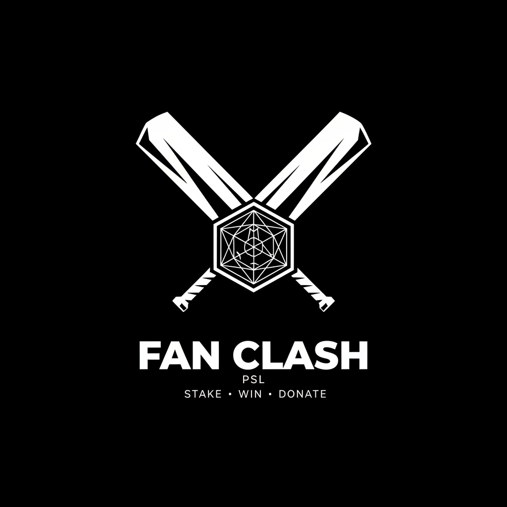

<p align="center">
  
</p>

<h1 align="center">PSL Fan Clash</h1>
<p align="center"><strong>Your Rivalry. Their Future.</strong></p>

<p align="center">
  The first charity-powered fan economy for Pakistan Super League cricket.<br/>
  Fans back their team. Winners earn rewards. 15% funds Pakistani charities. All on-chain.
</p>

<p align="center">
  <a href="https://wirefluidscan.com"></a>
  
  
  
  
</p>

<p align="center">
  <em>Built for <strong>Entangled 2026 Hackathon</strong> by WireFluid &middot; 10M PKR Prize Pool</em>
</p>

---

> **AI Agent:** This project includes a Claude Sonnet-powered match analysis agent (`lib/ai-agent.ts`). Add your `ANTHROPIC_API_KEY` to `.env` to enable AI-generated cricket analysis. Without the key, the app falls back to a local heuristic engine.

---

## The Problem

500 million people watch Pakistan Super League cricket every season. They scream at their screens, debate on WhatsApp groups, and pour emotion into every match.

**They own nothing from their fandom.**

- No verified fan identity exists for cricket
- No transparent way to back your team and earn rewards
- No mechanism to channel fan rivalry into social good
- Fan engagement generates billions in broadcast revenue — fans get zero back

---

## The Solution

**PSL Fan Clash turns cricket rivalry into charitable impact.**

Fans connect their wallet, pick their PSL team, and stake WIRE tokens on match outcomes. Every match pool is split:

| Split | Recipient | Purpose |
|-------|-----------|---------|
| **82%** | Winning fans | Rewarded for backing the right team |
| **15%** | Pakistani charities | Chosen by winning fans through DAO voting |
| **3%** | Platform | Gas subsidies for future users |

This isn't a prediction market. It's **fan engagement infrastructure** where every rivalry between Lahore Qalandars and Karachi Kings, every clash between Rawalpindi Pindiz and Peshawar Zalmi — directly funds Edhi Foundation, Shaukat Khanum, or The Citizens Foundation.

---

## Real World Impact

> *"500 million viewers. Zero on-chain fan infrastructure. PSL Fan Clash changes that."*

### For Pakistani Cricket Fans
- **Soulbound Fan ID** — permanent on-chain identity tied to your PSL team. Your Cricket IQ, prediction accuracy, and loyalty — all verifiable.
- **Micro-staking** — stake as little as 0.01 WIRE ($0.02). WireFluid's low gas makes this possible. On Ethereum, gas alone would cost $18 per stake.
- **PULSE loyalty tokens** — earned through correct predictions and charity votes. Real rewards for real engagement.
- **Urdu support** — 151 translation keys in cricket-flavored street Urdu. Because 75% of Pakistan prefers Urdu, and cricket fans in Lahore deserve an app that speaks their language.

### For Pakistani Charities
- **15% of every match pool** goes directly to charity — not as an afterthought, but as the core mechanic
- **Stake-weighted DAO voting** — winning fans choose which charity receives the funds
- **On-chain transparency** — every donation is auditable on WireScan. No middlemen. No hidden margins. Pure math.
- **Registered charities:** Edhi Foundation, Shaukat Khanum Memorial, The Citizens Foundation

### For PSL and Sponsors
- Verifiable fan engagement data — not self-reported surveys, but actual on-chain behavior
- Tokenized loyalty system that broadcast partners and sponsors can build on
- Fan identity infrastructure that scales across seasons

---

## How It Works

```
Fan connects wallet
    ↓
Picks PSL team → Gets soulbound Fan ID (0.01 WIRE)
    ↓
Backs their team in upcoming match (stakes WIRE)
    ↓
Match resolves → 82% to winners / 15% to charity / 3% platform
    ↓
Winners claim rewards + earn PULSE tokens
    ↓
Winning fans vote on which charity receives the 15%
    ↓
Charity receives WIRE directly on-chain
```

---

## Architecture

```
┌────────────────────────────────────────────────────────────┐
│                      PSL FAN CLASH                          │
├───────────────┬──────────────┬──────────────┬──────────────┤
│ MatchFactory  │  MatchVault  │  CharityDAO  │ Leaderboard  │
│  (deploys)    │  (per match) │  (voting)    │  (stats)     │
│               │              │              │              │
│ createMatch───┼──►stakeTeam  │              │              │
│ lockMatch─────┼──►lockMatch  │              │              │
│ resolveMatch──┼──►resolve────┼──►startVote  │              │
│               │  82% winners │  15% charity │              │
│               │  3% platform │  48hr vote   │              │
│               │  recordStake─┼──────────────┼──►recordStake│
│               │  recordWin───┼──────────────┼──►recordWin  │
├───────────────┼──────────────┼──────────────┼──────────────┤
│    FanID      │  PulseToken  │              │              │
│  (soulbound   │  (loyalty    │              │              │
│   ERC-721)    │   ERC-20)    │              │              │
├───────────────┴──────────────┴──────────────┴──────────────┤
│  NASA POWER API (Weather) │ AI Match Analysis Engine       │
│  WireFluid Testnet (Chain ID 92533) │ wagmi + viem         │
└────────────────────────────────────────────────────────────┘
```

---

## Features

| Feature | Description |
|---------|-------------|
| **Rivalry Staking** | Back your PSL team with WIRE. 82/15/3 charity split on every match. |
| **Soulbound Fan ID** | ERC-721 non-transferable identity. One per fan. Stores Cricket IQ and engagement stats. |
| **PULSE Tokens** | ERC-20 loyalty tokens. 10 per win, 5 per charity vote, 20 for first Fan ID. |
| **Charity DAO** | 48-hour stake-weighted voting. Winning fans direct 15% to Edhi, Shaukat Khanum, or TCF. |
| **NASA Weather** | Real satellite data from NASA POWER API for all 6 PSL stadiums. Cricket-specific impact analysis. |
| **AI Match Analysis** | Heuristic engine referencing real players (Shaheen Afridi, Babar Azam, Rizwan). Weather-adjusted. |
| **Urdu Toggle** | 151 translation keys. Cricket-flavored street Urdu. RTL support. |
| **CometBFT Visualization** | Animated consensus steps after every transaction. Shows how WireFluid secures funds. |
| **Live Block Feed** | Real-time block data from WireFluid chain. |
| **Transaction Receipts** | Gas comparison with Ethereum after every action. |
| **For Judges Page** | `/judges` — Security audit, scoring self-assessment, architecture, gas optimization, RPC efficiency. |
| **Analytics Dashboard** | `/analytics` — Team popularity, gas savings counter, platform stats. |

---

## Why WireFluid

This project was built **FOR** WireFluid, not just **ON** it.

| Feature | WireFluid | Ethereum |
|---------|-----------|----------|
| Stake gas cost | **$0.003** | $18.50 |
| Finality | **~5 seconds** | ~13 minutes |
| Min viable stake | **0.01 WIRE** | Uneconomical |
| Fan ID mint | **$0.002** | $18.50 |
| Cross-chain future | **IBC to 50+ chains** | Bridges required |

Instant finality locks stakes the moment a match goes live — impossible on Ethereum where 13-minute confirmation would let someone stake after seeing the toss result.

---

## Smart Contracts (WireFluid Testnet — Chain 92533)

| Contract | Address | Purpose |
|----------|---------|---------|
| MatchFactory | `0x5bedf00C875b77C743115eE2056Fd4cEfD3Df6E1` | Deploys per-match vaults via CREATE2 |
| CharityDAO | `0x695f4375495255973258676A4Eb9ff9c1C65055D` | 48hr stake-weighted charity voting |
| SeasonLeaderboard | `0x2630E8B789488FcE3400404A54C9aC09C39e5509` | Fan engagement + team charity stats |
| FanID | `0xEBFB5cce6549Ef3A5287cfA62f3C795b4A04eC3d` | Soulbound ERC-721 fan identity |
| PulseToken | `0x2f4C1EC2E0CC7AFaF320657b0cebcFC95679358a` | ERC-20 loyalty rewards |

**Security:** OpenZeppelin ReentrancyGuard, CEI pattern, custom errors, NatSpec documentation, soulbound anti-sybil, stake-weighted voting, emergency cancel with full refunds.

All contracts verified on [WireScan Explorer](https://wirefluidscan.com).

---

## Tech Stack

| Layer | Technology |
|-------|------------|
| Blockchain | WireFluid Testnet (Chain 92533, EVM + Cosmos, CometBFT) |
| Smart Contracts | Solidity ^0.8.28, OpenZeppelin 5.x, Hardhat, Cancun EVM |
| Frontend | Next.js 16 (App Router), TypeScript strict, Tailwind CSS |
| Web3 | wagmi v3, viem, MetaMask |
| Data | NASA POWER API, AI heuristic engine |
| i18n | English + Urdu (151 keys, RTL) |
| Fonts | Clash Display, Satoshi, JetBrains Mono |

---

## Quick Start

```bash
git clone https://github.com/Ibrahim4594/PSL-FAN-CLASH.git
cd PSL-FAN-CLASH
npm install
npm run dev
```

Open http://localhost:3000. Connect MetaMask to WireFluid Testnet (Chain ID 92533).

Get free test WIRE: [faucet.wirefluid.com](https://faucet.wirefluid.com)

---

## Links

| Resource | URL |
|----------|-----|
| WireScan Explorer | [wirefluidscan.com](https://wirefluidscan.com) |
| WireFluid Faucet | [faucet.wirefluid.com](https://faucet.wirefluid.com) |
| WireFluid Docs | [docs.wirefluid.com](https://docs.wirefluid.com) |
| For Judges | `/judges` page on deployed site |

---

## Built By

**Ibrahim Samad** — Agentic AI Developer & Full-Stack Engineer

| Achievement | Organization |
|-------------|-------------|
| HBL P@SHA ICT Awards — **Finalist** | P@SHA Pakistan |
| United Nations SDG Hackathon — **Finalist** | United Nations |
| NASA Space Apps Challenge — **Global Nominee & Ambassador** | NASA |
| Eastern Michigan University — **1st Place Gold Medal** | EMU (School-Level Competition) |
| NEO Science Olympiad — **Gold Medal (Mathematics)** | NEO Science |
| Copernicus Olympiad — **Gold Medal (Mathematics)** | Copernicus |
| NEO Science Olympiad — **Silver Medal (Coding)** | NEO Science |

---

<p align="center">
  <strong>Your Rivalry. Their Future.</strong><br/>
  <em>Built for Entangled 2026 Hackathon by WireFluid.</em>
</p>
